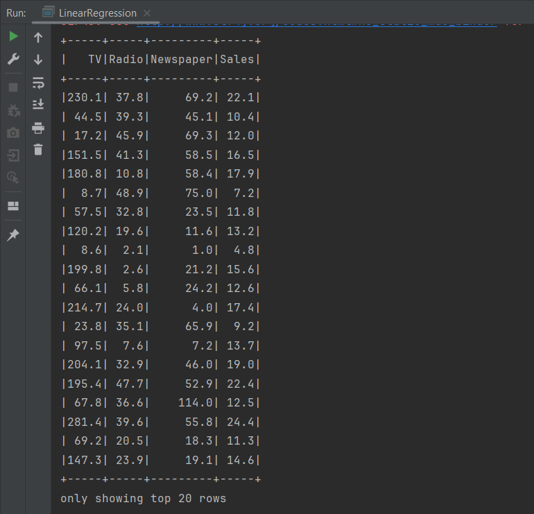
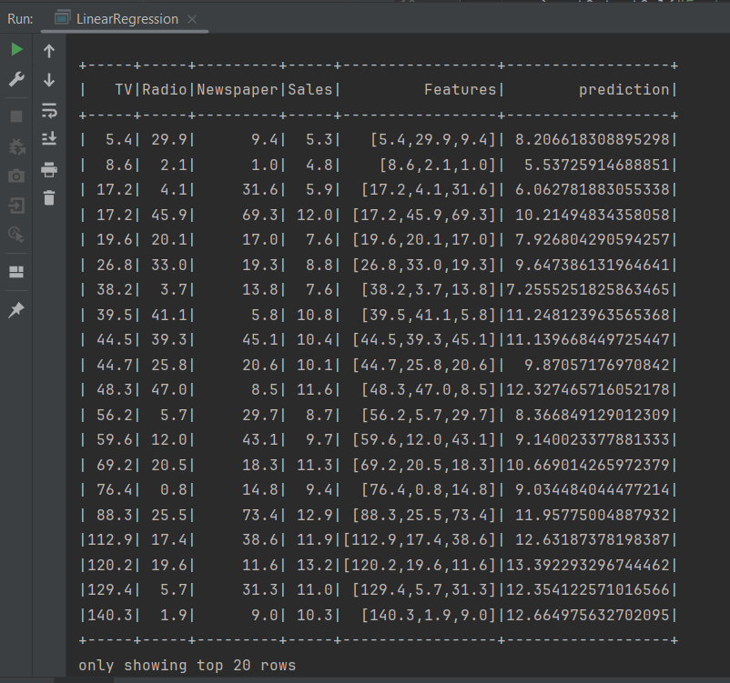
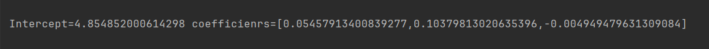
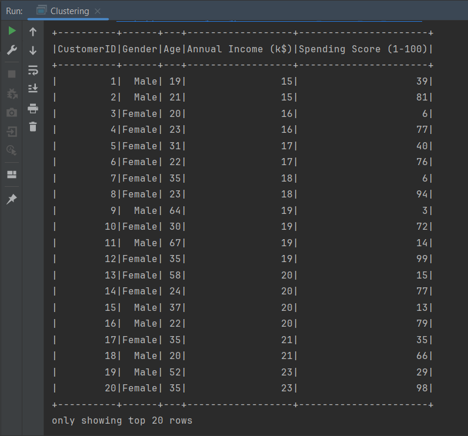
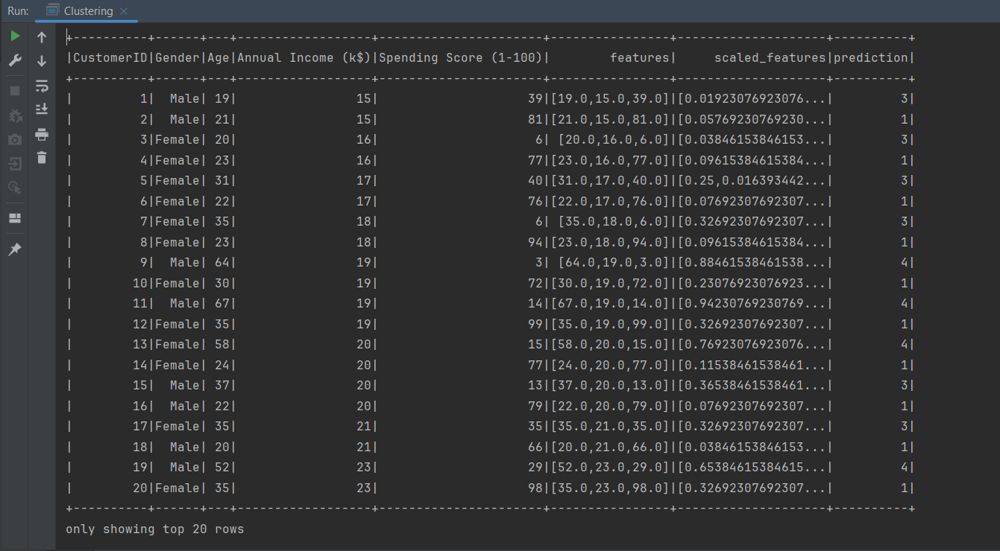
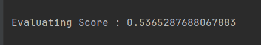

# Spark ML

## Introduction 
Spark is a universal parallel computing framework developed by the UC Berkeley AMPLab in 2009, was open sourced in early 2010, and moved to the Apache Software Foundation in 2013. It is a fast, versatile, and scalable memory-based big data computing engine. 
MapReduce-based computing engines typically output intermediate results to disks for storage and fault tolerance. Spark stores intermediate results in memory to reduce the I/O of the underlying storage system and improve the computing speed. It is a one-stop solution that integrates batch processing, real-time stream processing, interactive query, graph computing, and machine learning. Spark can process data requirements in different scenarios, including batch processing, interactive query, real-time stream processing, and machine learning.  
Spark not only outperforms MapReduce, but also is compatible with the Hadoop ecosystem. It can run on Hadoop HDFS to provide enhanced functions. To some extent, Spark replaces Hadoop MapReduce. It is still compatible with YARN and Apache Mesos in Hadoop so existing Hadoop users can easily migrate their workloads to Spark.It typical Use Cases :
- Batch processing can be used for extracting, transforming, and loading (ETL).
- Machine learning can be used to automatically determine whether the comments of online buyers are positive or negative.
- Interactive analysis can be used to query the Hive warehouse.
- Stream processing can be used for real-time businesses analysis (such as page-click streams), recommendation systems, and public opinion analysis. 

## Spark MLib

## Objective

## Application
1. Linear Regression
<table >
    <thead>
        <tr>
            <th>Data Overview</th>
            <th>Predictions</th>
        </tr>
    </thead>
    <tbody>
        <tr>
            <td></td>
            <td></td>
        </tr>
    </tbody>
   <thead>
        <tr>
            <th>Interc & Coeff</th>
            <th>Evaluation</th>
        </tr>
    </thead>
    <tbody>
        <tr>
            <td></td>
            <td></td>
        </tr>
    </tbody>
</table>
  

1. Clustring
<table >
    <thead>
        <tr>
            <th>Data Overview</th>
            <th>Clustring</th>
            <th>Evaluation</th>
        </tr>
    </thead>
    <tbody>
        <tr>
            <td></td>
            <td></td>
            <td></td>
        </tr>
    </tbody>
</table>
  
